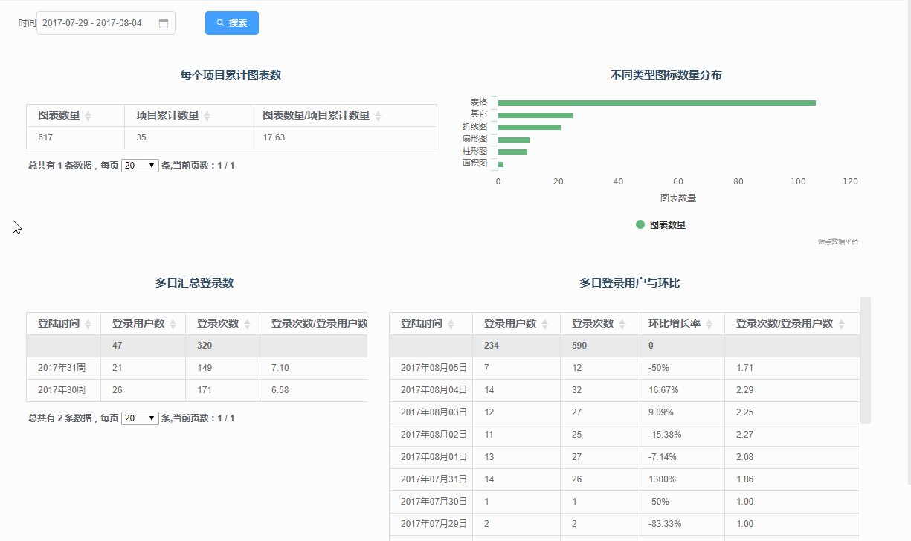
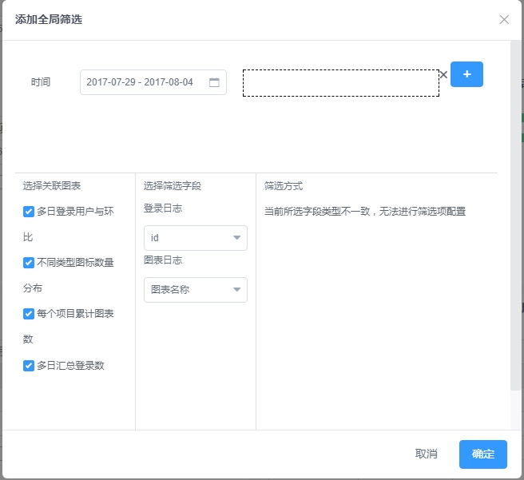
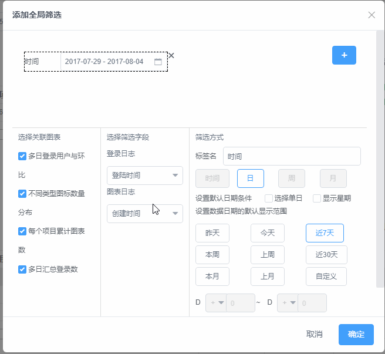

### **应用分析**

---

应用分析中心，有不同的数据报表组成，每个报表中有用户自定义显示的数据图表。

#### **功能列表**

如上图所示，报表各功能入口的内容如下：

1. 数据报表管理操作
   1. 搜索功能：可以对数据报表名称进行搜索查询
   2. 添加按钮：点击弹窗可以添加新的数据报表
2. 添加图表：在当前报表中添加新的图表
3. 全局筛选：增加图表数据筛选条件
4. 图表操作
   1. 刷新：点击更新图表数据
   2. 编辑：点击跳转到此图表的配置页面，加载原有图表编辑内容
   3. 删除：点击在当前报表删除此图表

#### **数据报表布局**

功能报表中各个图表的位置和大小均可以自由设置，可以通过拖拽图表表头区域来进行位置调整，通过图表右下角小箭头设置图表尺寸。如下图所示。

####全局筛选器
在报表展示页面，源点数据平台支持为整个报表添加筛选器，通过筛选器过滤数据以后，可以对其关联的所有图表进行数据筛选。

#####**操作步骤**
1. 点击报表展示页面右上角“全局筛选”按钮；
2. 在弹出的对话框中添加一个筛选控件预览框；
3. 选择与筛选器相关联的图表，系统会自动加载出所勾选图表关联的日志表；
 
4. 设置该筛选控件作为筛选的字段，**注意：如果筛选字段来源于两张及以上的数据表时，需要选择类型一致的字段作为筛选字段，否则无法设置**；
 
5. 设置完成后，在对话框右侧部分会出现筛选控件默认条件的设置区域，此设置主要为了保证设置初始条件，能够保证报表在每次加载时都显示此条件。
 
6. 对话框上部分支持预览设置的筛选条件。

